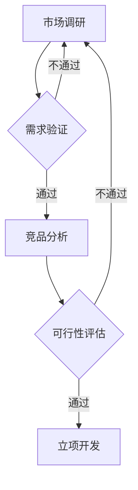

# ClackyAI 产品开发策略详解

## 目录
1. [产品选择方法论](#产品选择方法论)
2. [产品类型库](#产品类型库)
3. [开发流程标准化](#开发流程标准化)
4. [技术架构建议](#技术架构建议)
5. [产品验证框架](#产品验证框架)

---

## 产品选择方法论

### SHINE 产品筛选法则

好的产品必须满足以下 5 个标准（缺一不可）：

#### **S - Specific（具体明确）**
- ✅ 解决一个具体的问题
- ✅ 目标用户清晰
- ❌ 避免：大而全的平台型产品

#### **H - High-demand（高需求）**
- ✅ 市场搜索量 > 1000/月
- ✅ 有竞品证明需求存在
- ❌ 避免：无人搜索的伪需求

#### **I - Implementable（可快速实现）**
- ✅ 2-3 天可完成 MVP
- ✅ ClackyAI 可直接支持核心功能
- ❌ 避免：需要复杂技术的产品

#### **N - Niche（细分市场）**
- ✅ 聚焦特定领域/人群
- ✅ 竞争相对较小
- ❌ 避免：红海市场直接竞争

#### **E - Easy-to-monetize（易变现）**
- ✅ 清晰的付费理由
- ✅ 用户有付费意愿
- ❌ 避免：难以变现的工具

### 三步产品选择流程



#### 步骤 1：市场调研（1 小时）

**工具清单**：
- Google Trends - 搜索趋势
- Keyword Tool - 关键词搜索量
- Reddit / Twitter - 用户讨论
- Indie Hackers - 创业者社区

**调研问题清单**：
- [ ] 这个问题有多少人在搜索？
- [ ] 用户在哪些平台讨论这个问题？
- [ ] 用户如何描述他们的痛点？
- [ ] 用户愿意为解决方案付多少钱？

#### 步骤 2：竞品分析（1 小时）

**分析维度**：
- 竞品数量（3-10 个最佳）
- 竞品价格（$5-$50/月较合理）
- 竞品评价（找差评，找机会）
- 竞品功能（找缺失，找突破口）

**竞品分析模板**：
```
产品名称：___________
网址：___________
定价：___________
核心功能：___________
用户评价：___________（查看负面评价）
差异化机会：___________
```

#### 步骤 3：可行性评估（30 分钟）

**评估清单**：
- [ ] ClackyAI 可以实现核心功能吗？
- [ ] 开发时间预计多久？（< 3 天）
- [ ] 需要额外的技术栈吗？
- [ ] 运营成本可控吗？（< $100/月）
- [ ] 有清晰的推广渠道吗？

---

## 产品类型库

### 一、高优先级产品类型（建议前 30 个产品选择）

#### 1️⃣ 移动端 APP（10-15 个产品）

**特点**：用户粘性强，变现潜力大，市场需求旺盛

| 产品方向 | 目标用户 | 核心功能 | 定价建议 | 开发难度 |
|---------|---------|---------|---------|---------|
| **AI 习惯追踪器** | 自我提升者 | 习惯打卡、数据可视化、AI 分析 | $4.99/月 | ⭐⭐⭐ |
| **极简待办清单** | 效率人群 | 任务管理、提醒、番茄钟 | $2.99/月 | ⭐⭐ |
| **睡眠记录助手** | 健康关注者 | 睡眠追踪、分析报告、改善建议 | $6.99/月 | ⭐⭐⭐ |
| **健身计划生成器** | 健身爱好者 | AI 定制计划、进度追踪、视频指导 | $9.99/月 | ⭐⭐⭐⭐ |
| **快速日记 App** | 写作爱好者 | 语音转文字、情绪分析、回顾 | $3.99/月 | ⭐⭐⭐ |
| **饮水提醒器** | 健康人群 | 智能提醒、饮水追踪、健康建议 | $1.99/月 | ⭐⭐ |
| **卡路里扫描器** | 减肥人群 | 拍照识别食物、卡路里计算、饮食建议 | $7.99/月 | ⭐⭐⭐⭐ |
| **专注时间管理** | 学生/职场人 | 番茄钟、白噪音、数据统计 | $4.99/月 | ⭐⭐ |
| **预算管理 App** | 理财人群 | 收支记录、预算设置、报表分析 | $5.99/月 | ⭐⭐⭐ |
| **冥想引导 App** | 压力人群 | 引导音频、呼吸练习、睡眠故事 | $8.99/月 | ⭐⭐⭐ |
| **宠物健康记录** | 宠物主人 | 健康档案、疫苗提醒、体重追踪 | $3.99/月 | ⭐⭐ |
| **快速笔记扫描** | 学生/白领 | 文档扫描、OCR、云同步 | $4.99/月 | ⭐⭐⭐ |

#### 2️⃣ AI 增强工具类（Web 应用，15-20 个产品）

**特点**：需求明确，易变现，技术门槛低

| 产品方向 | 目标用户 | 核心功能 | 定价建议 | 开发难度 |
|---------|---------|---------|---------|---------|
| **AI 简历优化器** | 求职者 | 简历分析、优化建议、ATS 检测 | $9.99/次 | ⭐⭐ |
| **AI 邮件助手** | 职场人士 | 邮件撰写、回复建议、语气调整 | $4.99/月 | ⭐⭐ |
| **AI 社交媒体文案生成器** | 创作者/营销人员 | 多平台文案、hashtag 建议 | $19.99/月 | ⭐⭐ |
| **AI 会议记录助手** | 远程工作者 | 会议转录、总结、待办提取 | $14.99/月 | ⭐⭐⭐ |
| **AI 语法检查器（特定行业）** | 专业人士 | 法律/医疗/技术文档检查 | $29.99/月 | ⭐⭐⭐ |
| **AI 商品描述生成器** | 电商卖家 | 产品描述、SEO 优化 | $24.99/月 | ⭐⭐ |
| **AI 视频脚本生成器** | YouTuber | 脚本、标题、描述生成 | $14.99/月 | ⭐⭐ |
| **AI 客户评论分析器** | 店铺老板 | 评论分类、情感分析、改进建议 | $39.99/月 | ⭐⭐⭐ |

#### 3️⃣ 垂直领域 SaaS（Web 应用，10-15 个产品）

**特点**：细分市场，高客单价，用户粘性强

| 产品方向 | 目标用户 | 核心功能 | 定价建议 | 开发难度 |
|---------|---------|---------|---------|---------|
| **自由职业者项目管理** | 自由职业者 | 项目追踪、时间记录、发票生成 | $19.99/月 | ⭐⭐⭐ |
| **在线课程平台（微型）** | 知识博主 | 课程上传、付费、学员管理 | $29.99/月 | ⭐⭐⭐⭐ |
| **餐厅菜单二维码生成器** | 餐厅老板 | 在线菜单、订餐、多语言 | $14.99/月 | ⭐⭐ |
| **租房管理系统（小房东）** | 个人房东 | 租客管理、租金提醒、维修记录 | $24.99/月 | ⭐⭐⭐ |
| **健身教练客户管理** | 私教 | 训练计划、进度追踪、预约 | $29.99/月 | ⭐⭐⭐ |
| **宠物店预约系统** | 宠物店 | 预约、客户管理、提醒 | $19.99/月 | ⭐⭐⭐ |
| **活动票务系统（小型）** | 活动组织者 | 售票、签到、数据分析 | $9.99/活动 | ⭐⭐⭐⭐ |

#### 4️⃣ 内容变现工具（Web 应用，5-10 个产品）

**特点**：创作者市场大，推广容易，复购率高

| 产品方向 | 目标用户 | 核心功能 | 定价建议 | 开发难度 |
|---------|---------|---------|---------|---------|
| **数字产品商店** | 创作者 | 销售电子书/模板/课程 | $14.99/月 | ⭐⭐⭐ |
| **付费会员社区** | 内容创作者 | 会员订阅、独家内容 | $29.99/月 | ⭐⭐⭐⭐ |
| **赞赏/打赏页面** | 博主/创作者 | 一次性打赏、订阅 | $4.99/月 | ⭐⭐ |
| **Newsletter 订阅工具** | 写作者 | 邮件列表、发送、付费订阅 | $19.99/月 | ⭐⭐⭐ |
| **链接合集页（Bio Link）** | 社交媒体博主 | 多链接整合、数据分析 | $9.99/月 | ⭐⭐ |

### 二、中优先级产品类型（中期扩展）

#### 5️⃣ 生产力工具（Web 应用）
- ⏰ 番茄钟 + 任务管理
- 📝 笔记应用（特定场景）
- 🔖 书签管理器
- 📊 个人数据看板

#### 6️⃣ 个人品牌工具（Web 应用）
- 🌐 个人网站生成器
- 💼 作品集展示
- 📧 个人邮箱管理
- 📱 名片二维码

### 移动端 APP 开发特别说明

#### 技术栈建议

**跨平台框架**：
- **React Native** - 适合快速开发，社区强大
- **Flutter** - 性能优异，UI 美观
- **PWA（Progressive Web App）** - 无需应用商店，快速迭代

#### 发布渠道

1. **App Store（iOS）**
   - 年费：$99/年
   - 审核时间：1-3 天
   - 市场特点：用户付费意愿强

2. **Google Play（Android）**
   - 一次性费用：$25
   - 审核时间：数小时
   - 市场特点：用户基数大

3. **第三方平台**
   - TestFlight（iOS 测试）
   - PWA 直接发布

#### APP 变现策略

- **免费 + 内购**：基础功能免费，高级功能付费
- **订阅制**：月度/年度订阅
- **广告收入**：Google AdMob / Facebook Audience Network
- **一次性购买**：适合工具类 APP

### 三、产品创意发现渠道

**每日必看**（30 分钟）：
1. **Product Hunt** - 查看新产品，评论区找痛点
2. **Indie Hackers** - 看创业者讨论
3. **Reddit**（r/SaaS, r/Entrepreneur） - 找"我需要..."的帖子
4. **Twitter**（搜索"I wish there was"） - 找用户抱怨

**每周必做**（2 小时）：
1. **竞品分析** - 深入研究 3-5 个竞品
2. **用户访谈** - 与 5-10 个潜在用户聊天
3. **数据分析** - 查看 Google Trends 趋势
4. **社区互动** - 在相关社区回答问题，发现需求

---

## 开发流程标准化

### MVP 开发 3 天冲刺法

#### Day 1：核心功能开发（8 小时）
**上午**（4 小时）：
- 用 ClackyAI 生成基础框架
- 设计数据库结构
- 实现核心功能（只做最核心的）

**下午**（4 小时）：
- 用户认证设置
- 支付集成
- 基础 UI 优化

#### Day 2：完善与测试（8 小时）
**上午**（4 小时）：
- 补充次要功能
- 错误处理
- 响应式设计

**下午**（4 小时）：
- 自测所有功能
- 修复 bug
- 性能优化

#### Day 3：上线准备（8 小时）
**上午**（4 小时）：
- 制作 Landing Page
- SEO 基础设置
- 编写使用文档

**下午**（4 小时）：
- 部署上线
- 最后测试
- 准备推广材料

### 必备功能清单（MVP）

**核心功能（必须有）**：
- [ ] 用户注册/登录
- [ ] 核心功能（1-3 个）
- [ ] 付费订阅/购买
- [ ] 基础用户引导

**次要功能（可后加）**：
- [ ] 用户仪表板
- [ ] 使用教程
- [ ] 客服聊天
- [ ] 数据导出

**暂不需要**：
- ❌ 团队协作
- ❌ API 接口
- ❌ 高级分析
- ❌ 多语言

---

## 技术架构建议

### 基于 ClackyAI 的技术栈

**前端**：
- ClackyAI 默认生成
- 必要时自定义 CSS
- 使用 Tailwind CSS 快速样式

**后端**：
- ClackyAI 内置后端
- 数据库：PostgreSQL（推荐）
- 认证：ClackyAI 内置

**第三方服务**：
- **支付**：Stripe（必备）
- **邮件**：SendGrid / Mailgun
- **分析**：Google Analytics + Plausible
- **客服**：Crisp / Tawk.to（免费）
- **表单**：Typeform（部分产品）

### 基础架构成本（每产品/月）

| 服务 | 提供商 | 免费额度 | 付费起价 | 推荐方案 |
|-----|-------|---------|---------|---------|
| **托管** | Vercel/Netlify | 较大免费额度 | $20/月 | 初期免费 |
| **数据库** | Supabase | 500MB | $25/月 | 初期免费 |
| **支付** | Stripe | 无月费 | 2.9%+$0.3/笔 | 按交易收费 |
| **邮件** | SendGrid | 100/天 | $15/月 | 初期免费 |
| **域名** | Namecheap | - | $10/年 | 必须购买 |

**单产品初始成本**：$10-20（仅域名）
**单产品运营成本**：$0-30/月（视流量而定）

---

## 产品验证框架

### 验证金字塔（5 步验证法）

```
        产品上线
       /        \
     内测反馈
    /          \
  Landing Page
  /            \
社交媒体投票
/              \
需求假设验证
```

### 第 1 层：需求假设验证（1 天）

**方法**：
- 在 Reddit/Twitter 发帖："我在做 XXX 工具，有人需要吗？"
- 加入相关 Facebook 群组/Discord 询问
- 制作简单问卷（Google Forms）

**通过标准**：
- 有 20+ 人表示感兴趣
- 至少 5 人愿意付费

### 第 2 层：社交媒体投票（2 天）

**方法**：
- 制作产品概念图（用 Figma/Canva）
- 在 Twitter/LinkedIn 发布并征求意见
- 在相关社区分享

**通过标准**：
- 获得 50+ 点赞/互动
- 有人主动询问何时上线

### 第 3 层：Landing Page（3 天）

**必备元素**：
- 清晰的价值主张
- 功能说明（3-5 个核心功能）
- 定价信息
- 邮箱收集表单
- CTA 按钮（"加入等候名单"）

**工具推荐**：
- Carrd（$19/年）
- Unicorn Platform（$8/月）
- 直接用 ClackyAI 生成

**通过标准**：
- 1 周内收集 100+ 邮箱
- 转化率 > 5%（访客到邮箱订阅）

### 第 4 层：内测反馈（1 周）

**内测用户招募**：
- 从邮箱列表邀请 20-30 人
- 提供限时免费使用
- 要求详细反馈

**收集信息**：
- 哪些功能最有用？
- 哪些功能缺失？
- 愿意付多少钱？
- 会推荐给朋友吗？

**通过标准**：
- 至少 10 人持续使用（3 天以上）
- 至少 5 人表示愿意付费
- NPS 评分 > 30

### 第 5 层：产品上线（立即）

**上线清单**：
- [ ] 修复内测发现的关键 bug
- [ ] 定价确定
- [ ] 付费功能正常工作
- [ ] Landing Page 完善
- [ ] 推广渠道准备好

---

## 产品开发常见问题

### Q1：是否每个产品都需要完整验证？
**A**：不需要。对于开发成本极低（< 2 天）的产品，可以直接做出 MVP 验证。但对于需要 > 3 天的产品，建议至少做前 3 层验证。

### Q2：产品失败了怎么办？
**A**：快速放弃。如果上线 2 周没有付费用户，除非有明确改进方向，否则应该立即停止投入，转向下一个产品。

### Q3：可以复制竞品吗？
**A**：可以，但必须有明确差异化：
- 更低价格（简化功能）
- 更好体验（UI/UX）
- 更专注细分（特定行业）

### Q4：产品之间应该有关联吗？
**A**：建议有一定关联性：
- 目标用户相似（方便交叉推广）
- 可以用统一品牌（建立信任）
- 但不要强行整合，保持产品独立性

---

## 下一步行动

1. ✅ 使用 SHINE 法则筛选 10 个产品创意
2. ✅ 对每个创意进行 1 小时快速调研
3. ✅ 选择 3 个最有潜力的进行深度验证
4. ✅ 开始第一个产品的 MVP 开发

**相关文档**：
- [03-成本分析详解.md](./03-成本分析详解.md) - 了解每个产品的成本结构
- [04-运营推广方案.md](./04-运营推广方案.md) - 产品上线后的推广策略

---

**文档版本**：v1.0  
**最后更新**：2025-11-11

